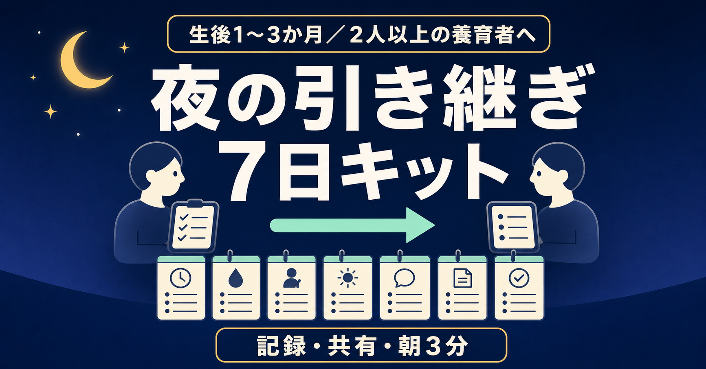
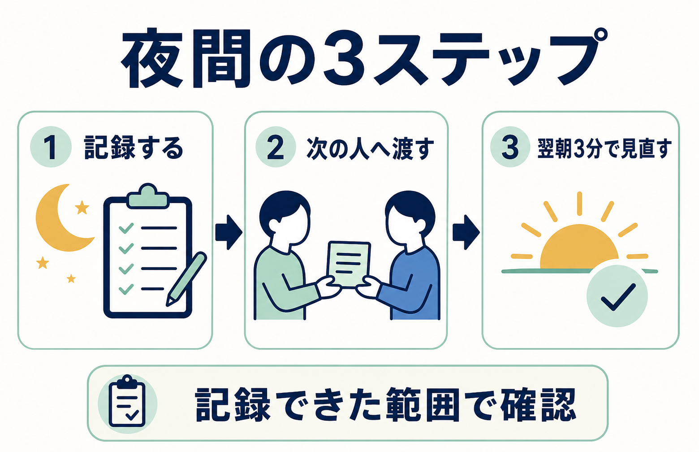

preview_only_unapproved / unpublished



# 【生後1〜3か月】授乳・おむつ「前回は何時？」を確認しやすくする

## 2人で回す夜間育児の記録・引き継ぎ7日キット

夜中に赤ちゃんへ対応したはずなのに、朝になると時刻や回数があいまいになる。

2人で交代していると、「最後はどっち？」「次は何を確認する？」も分かりにくい。

この記事は、赤ちゃんを必ず寝かせたり、夜泣き・授乳の回数を減らしたりする方法ではありません。目指すのは、次の状態です。

> 夜間に「誰が・いつ・何をしたか」を残し、記録できた範囲で、次の担当者が前回の対応と確認事項を見つけやすくすること。

無料部分に一晩版、有料部分に7日版をまとめました。

---

## 先にお伝えしたいこと

### この記事が合いそうな方

- 生後1〜3か月ごろで、2人以上の養育者が何らかの夜間・朝の引き継ぎをしている
- 2人とも育休中である必要はない。片方が就労中でも、就寝前・早朝・休日に記録や対応を引き継いでいる
- 朝になると、ミルク・おむつなどの対応時刻や担当があいまいになる
- 共有アプリやメモはあるが、「次の人への一言」が抜けやすい
- 完璧な育児記録より、夜間の入力項目を最小限に抑えたい
- まず一週間だけ試し、自分たちに必要か判断したい

### この記事が合わない方

- 赤ちゃんが必ず寝る方法、夜泣きを止める方法を探している
- 授乳の間隔・量・方法、夜間断乳の可否など、医療・栄養上の判断を求めている
- 病気や発達、睡眠障害の診断を求めている
- 記録を取ること自体が、現在の心身に大きな負担となっている
- 赤ちゃんに緊急性のある症状が見られる

本記事は、家庭内の記録と引き継ぎを整えるための一般的なテンプレートです。授乳や睡眠について医師・助産師・保健師等から個別の指示を受けている場合は、その指示を優先してください。

---

## 【本人経験】なぜ、この形を作ったのか

生後1か月から3か月までの約3か月、わが家では夜中のミルクやおむつ対応を記録する「夜間対応メモ」を使いました。

きっかけは、朝になると「昨日の夜は何時にミルクをあげたっけ？」と思い出せないことが多々あったからです。夫婦交代では、相手の対応時刻も分からなくなりました。

そこで、スマホのホーム画面にショートカットを置き、起きたらボタンをタップして「ミルク」「おむつ」などを選ぶ形にしました。記録が残ることで、朝に「2時と5時に起きた」と確認しやすくなり、お互いの対応履歴も見えるようになりました。

一方で、微妙だった点もあります。

寝ぼけた状態では、スマホを開くこと自体が面倒でした。ボタンを押すだけでも、記録を忘れる夜がありました。

現在はスマートスピーカーの音声記録へ移行しています。この経験から、次の3点を先に決める形にしました。

1. 最低限、何を残すか
2. 次の担当者へ、何を渡すか
3. 入力できなかったとき、どう補うか

以下は、この本人経験を土台にした編集設計です。7日運用の手順や判定基準は本人の実績値ではありません。

---

## 【企画根拠】集計データから見えた、困りごとの重なり

Mamariの0〜4か月に関する8,755件を、本文を引用・言い換えせず、テーマ別に集計しました。

- 夜間対応に関するもの：1,456件（16.63%）
- 授乳に関するもの：2,857件（32.63%）
- 夫婦・分担に関するもの：2,752件（31.43%）
- 夜間対応と夫婦・分担が重なるもの：552件（6.30%）
- 夜間対応、夫婦・分担、授乳の3テーマが重なるもの：301件（3.44%）

ここから言えるのは、3テーマが重なる相談が一定数あることまでです。**同じ割合の購入希望者がいるという意味ではなく、購入意向や購入率も示しません。**

この件数は内部の語句・ルール分類による探索値です。相談内容の重要度を人が一件ずつ評価した結果でも、Mamari全利用者や育児家庭全体の人気順位でもありません。月齢タグの重複、収集上限、相談を投稿する人の自己選択もあります。

内部参照用に検索結果から人手で選んだ、2026年5月4日〜8月20日公開の有料note100件では、公開価格の中央値は300円、中央50%は200〜500円でした。無作為標本ではないため、note市場全体の相場とはみなしません。この標本内で、睡眠中心17件は中央値500円、テンプレート中心4件は中央値730円でした。ただし後者はn=4で、真の販売数もほぼ不明です。「夜間対応＋記録・テンプレート＋夫婦」を中心訴求する商品は0件でした。

0件は、未開拓と需要未実証の両方を意味します。

この未公開稿では、**検証開始価格を500円**に設定します。内部標本の中央50%の上限であり、睡眠中心17件の中央値でもありますが、真の販売数や本商品の支払意思は分かりません。付録4点と7日間の運用設計に500円の価値がある、という未検証の仮説を確かめるための開始価格です。

翌朝レビューは3分を7日間、合計21分の設計ですが、時間を価格へ換算して500円としたわけではありません。**3分は利用負荷を抑えるための設計、500円は付録4点と運用設計に対する価格仮説**として分けて扱います。

ここでいう適格PVは、主対象に合い、購入条件まで確認できた閲覧として、計測前に定義します。780円は、500円で1,000適格PVを計測し、20購入以上、CVR 2%以上、返金申請率5%以下、10件以上の利用回答でファイルを開けた割合90%以上・満足80%以上、安全問題0件、5家庭での使用性確認をすべて満たした場合に限り、次の独立したコホートで試す候補です。条件を満たしても適正価格の確定とはせず、値上げ後の結果を別に確認します。

300円は、500円で1,000適格PV後も購入5件未満で、10件以上集めた非購入理由の30%以上が価格を主因に挙げた場合だけ、別コホートの候補にします。「安いほど売れる」と仮定して先に下げることはしません。

---



このキットで繰り返すのは、上の3ステップだけです。記録できなかった部分を推測で埋めず、翌朝は育児の正解ではなく「引き継ぎの運用」を見直します。

## 今夜だけ試せる「一晩簡易版」

新しいアプリは入れず、紙・共有メモ・普段の育児記録アプリで、次の表だけを試してください。

| 時刻 | 担当 | 実際にしたこと | 数値・様子など必要な補足 | 次の担当者への一言 | 引き継ぎ済み |
|---|---|---|---|---|---|
|  |  | ミルク／おむつ／その他 |  |  | □ |
|  |  | ミルク／おむつ／その他 |  |  | □ |
|  |  | ミルク／おむつ／その他 |  |  | □ |

書き方のルールは3つだけです。

1. **記録より安全を優先する。** 落ち着いてから書く。書けない回があっても責めない。
2. **事実だけを書く。** 「たぶん」「いつも通り」で済ませず、不明なら「不明」と残す。
3. **最後に一言だけ渡す。** 「次回は家庭で決めた指示を確認」「気になる様子あり」など、次の人が最初に見る情報を書く。

朝になったら、引き継ぎに関わる人同士で次の3問だけ確認します。

- 記録がなくて迷った場面はあった？
- 多すぎて書けなかった項目はあった？
- 今夜、ひとつだけ変えるなら何？

この一晩版で十分なら、有料部分は不要です。家庭別の交代設計と7日間の見直しが必要な場合だけ、続きを検討してください。

---

## 必ず無料で読んでほしい安全情報

このテンプレートは、安全確認や医療判断の代わりにはなりません。記録のために赤ちゃんから目を離したり、安全でない場所へ置いたりしないでください。スマホ、紙、筆記具も寝床には置きません。

こども家庭庁は、1歳になるまでは医学上の理由がない限り、寝かせるときは**あおむけ**にすることを案内しています。寝具は身体が沈まない**硬めで平坦なもの**を使い、寝床にはぬいぐるみ、タオル、クッションなどを置かず、すっきりさせます。掛け布団が顔にかかる危険を避け、衣類や空調で調整します。ベビーベッド等は安全基準を満たす製品を説明書どおりに使用します。

大人の身体や寝具で赤ちゃんの口・鼻を塞ぐ危険があるため、赤ちゃん専用の寝床を用意することも案内されています。飲酒後、眠気や注意力低下を起こす薬を服用した人との添い寝、早産・低出生体重で生まれた赤ちゃんとの添い寝は、特に危険とされています。乳児の周囲では喫煙を避けます。

安全な睡眠については、公開時点の公的情報を必ず確認してください。

- [こども家庭庁「赤ちゃんが安全に眠れるように」](https://www.cfa.go.jp/policies/boshihoken/kenkou/sids)
- [消費者庁「就寝時の窒息事故に気を付けましょう」](https://www.caa.go.jp/policies/policy/consumer_safety/child/project_001/mail/20221028/)

### 判断に迷うときは #8000

休日・夜間に、子どもの症状への対処や受診の要否で迷ったときは、全国統一の**子ども医療電話相談 #8000**があります。地域の相談窓口へつながり、小児科医師・看護師から助言を受けられます。実施時間は都道府県により異なるため、居住地の情報も事前に確認してください。

- [厚生労働省「子どもの症状は #8000」](https://kakarikata.mhlw.go.jp/kakaritsuke/8000.html)

### 緊急時は記録せず119

消防庁は、次のような状態では、ためらわず119番へ連絡するよう案内しています。

- 意識がない、返事がない、もうろうとしている
- 呼吸が弱い、呼吸が苦しそうで顔色が悪い、くちびるが紫色
- けいれんが止まらない、または止まっても意識が戻らない
- 生後3か月未満で、いつもと違い様子がおかしい

このほかにも、緊急だと感じたときは記録や家庭内の相談を先にせず、119番へ連絡してください。

- [消防庁「救急車利用マニュアル」](https://www.fdma.go.jp/publication/portal/post2.html)

---

## 有料部分に含まれるもの

- 7日運用シート
- 毎回の夜間対応ログ
- 3つの家庭条件別・交代設計
- 引き継ぎの会話スクリプト
- 架空の記入例
- 翌朝3分レビュー
- 継続／変更／中止の判定表
- 紙／既存アプリ／音声入力の使い分け
- 共有・プライバシー確認チェック
- コピーして使える付録4点

検証開始価格：**500円**

付録版：`0.1-draft`／最終更新日：2026-08-23／現在の状態：未公開・購入不可

付録ファイルは次の4点です。

1. `01-seven-day-night-log.csv`（2,431バイト）— Day 1〜7、各日4行の夜間記録表
2. `02-seven-day-review.csv`（612バイト）— 翌朝3分レビューと7日目の判断表
3. `03-handoff-card.md`（756バイト）— 交代前に読む短いカード
4. `04-setup-privacy-checklist.md`（1,486バイト）— 入力手段、共有範囲、失敗時の代替

| 付録 | 購入前に確認できる主な項目 |
|---|---|
| 7日夜間ログ | 日、日付、時刻、記録者、実際の対応、必要な補足、次に確認すること、引き継ぎ済み |
| 7日レビュー | 最終対応を確認できたか、分からない箇所、入力の負担、今夜変える1点、継続／変更／中止 |
| 引き継ぎカード | 最後の記録、担当、対応、次に確認すること、共有事項、確認者 |
| セットアップ | 入力手段、最小項目、共有権限、通知、個人情報、記録できなかった時のルール |

### 購入前に確認する利用条件

- **必要環境**：CSV 2点はUTF-8 CSVを開ける表計算アプリ、Markdown 2点はUTF-8テキストを開けるメモ／テキスト編集アプリを使います。特定の有料アプリは不要です。
- **スマートフォン**：CSVは表計算アプリへ読み込み、原本を複製してから入力します。Markdownは普段の共有メモへ必要部分をコピーします。アプリごとの表示・共有仕様は各提供元に依存します。
- **紙**：各アプリの印刷機能を使うか、必要な項目だけ紙へ書き写します。専用のA4 PDFは含まれません。
- **更新方針**：将来公開する場合、ファイル不備、重大な誤記、公的安全情報へのリンク切れは確認後に修正し、記事末尾へ更新日と変更点を残します。機能追加や無期限更新は約束しません。
- **返金方針案**：この原稿は未公開のため、note上の返金設定はまだありません。将来公開する場合は「返金申請を受け付ける」を推奨案とし、実設定と購入前表示が一致するまで販売しません。申請可能期間や審査は[note公式の返金ルール](https://www.help-note.com/hc/ja/articles/360000670602-%E8%BF%94%E9%87%91%E3%83%AB%E3%83%BC%E3%83%AB%E3%81%A8%E3%82%88%E3%81%8F%E3%81%82%E3%82%8B%E3%81%94%E8%B3%AA%E5%95%8F)に従います。
- **問い合わせ範囲**：将来公開する場合、ファイル不備と記事の誤記はnote上のクリエイター問い合わせ導線で受け付ける案です。個別の授乳・睡眠・受診相談には回答しません。現在は未公開のため、販売用問い合わせURLはありません。

<!-- 編集注：公開作業は未承認。将来ユーザーが公開を判断した場合に限り、上記4ファイルをnoteへ添付し、購入前に形式と内容を再確認する。 -->

本商品に個別相談、診断、授乳量・間隔の指示、赤ちゃんの睡眠改善保証は含まれません。

---

# ここから先は有料部分です

---

## 最初に：4点の付録をコピーする

1. 添付された4ファイルを端末へ保存します。
2. `01-seven-day-night-log.csv`と`02-seven-day-review.csv`を表計算アプリで開き、編集用コピーを作ります。
3. `03-handoff-card.md`と`04-setup-privacy-checklist.md`は、UTF-8テキストとして開き、普段使う共有メモへ必要部分をコピーします。
4. 今夜は、セットアップ確認とDay 1だけを使います。7日分を先に埋めません。

ファイルを開けない場合は、この有料部分に同じ項目を掲載しているため、本文から共有メモや紙へコピーできます。表示崩れや文字化けがあれば、使用を始める前に購入先の案内から連絡してください。

<!-- 編集注：公開作業は未承認。将来ユーザーが公開を判断した場合に限り、この見出し直下へ4点を実際に添付し、ファイル名・サイズ・返金表示を再確認する。 -->

## 【編集設計】7日運用の全体像

この7日間の目的は、赤ちゃんの睡眠を変えることではありません。家庭内の記録と引き継ぎを、負担なく続く最小サイズまで削ることです。

| 日 | 試すこと | 翌朝に見ること |
|---|---|---|
| Day 1 | 変えずに現状を記録 | どこで迷ったか |
| Day 2 | 必須項目を3〜5個に絞る | 書かなかった項目は何か |
| Day 3 | 担当する時間帯・役割を決める | 担当が曖昧だった場面 |
| Day 4 | 引き継ぎ文を一文に統一 | 追加質問が必要だったか |
| Day 5 | 入力手順を一つ減らす | 入力忘れが減ったか |
| Day 6 | 入力できない時の予備手段を試す | 記録できたか／できなければ「不明」としたか |
| Day 7 | 一週間を振り返る | 継続・変更・中止を決める |

### 毎晩の開始前シート

```text
Day：
日付：

今夜の前半担当：
今夜の後半担当：
交代の目安：家庭で決めた時刻／合図／状況

医師・助産師等から受けている個別指示：あり／なし
※ありの場合は、内容を自己判断で変更せず確認できる場所を共有

今夜、必ず残す項目（3〜5個）：
1.
2.
3.
4.
5.

入力方法：紙／既存アプリ／共有メモ／音声
入力できない時の予備手段：
```

### 最初に確認する共有・プライバシー

- 閲覧・編集できる人を確認する
- 夜間の負担にならない通知設定にする
- 不要な氏名、住所、医療情報を入れない
- 音声入力では、誤認識、保存先、共有範囲を確認する
- 記録できない回は推測で埋めず「記録なし」とする

詳しい確認欄は付録`04-setup-privacy-checklist.md`にまとめています。

### 毎回の夜間対応ログ

```text
時刻：
担当：
実際にしたこと：ミルク／おむつ／その他（　　　　）
必要な数値・補足：
赤ちゃんの様子：
次の担当者が最初に確認すること：
入力方法：紙／アプリ／音声／後から追記
引き継ぎ：済／未／相手を起こして確認
```

授乳方法、量、間隔、赤ちゃんを起こすかどうかは、このシートでは決めません。家庭が医療者等から受けた指示と、すでに決めている方針に沿って、「実際に行った事実」だけを記録します。

---

## 3つの運用条件別・交代設計案

以下は一次体験から作った編集上の運用案で、3種類の家庭すべてで効果を検証したものではありません。家庭の事情や医療者からの個別指示を優先してください。

### 条件A：すべての対応を交代できる家庭

前半／後半など、家庭で無理のない担当ブロックを決めます。対応ごとに相手を起こすのではなく、交代時にログと一文の引き継ぎを渡します。

記録するもの：担当、時刻、実際にしたこと、必要な補足、次の確認事項。

### 条件B：授乳担当は固定し、周辺の役割を分ける家庭

授乳方法の事情などから、授乳担当を簡単に交代できない家庭向けです。授乳そのものを無理に均等化せず、もう一人が担当できる準備、記録、片付け、その他の合意済みの役割を先に決めます。

記録するもの：授乳担当を呼ぶ必要があるか、授乳以外で完了した役割、次に必要な準備、固定担当が休める時間帯。

### 条件C：勤務などで参加できる時間が限られる家庭

一晩を完全に半分にするのではなく、「就寝前の一定時間」「早朝」「休日」など、参加可能な範囲を固定します。毎晩その場で決め直さず、変更がある日は開始前シートだけ直します。

記録するもの：参加可能な時間、時間外の連絡条件、朝に引き継ぐ事項、その日に変更した理由。

どの条件でも、形式的な50対50を目標にしません。目標は、担当と次の行動が見えることです。体調や勤務が変わった日は、その日の条件を変更して構いません。

---

## 引き継ぎの会話スクリプト

以下は言い方を短くするためのテンプレートで、本人やMamari利用者の実際の発言記録ではありません。

### 交代するとき

> 「前半は私が担当。最後の対応は○時、したことは○○。次に最初に見てほしいのは○○。詳しくはログに残したよ」

### 記録できなかったとき

> 「○時ごろに対応したけれど、正確な時刻は不明。分かる範囲だけ記録した。推測では埋めていないよ」

### 一人では続けにくいとき

> 「今夜はこのまま続けるのが難しい。次の対応から交代できる？　できない場合は、朝の役割を相談したい」

### 相手のやり方を責めそうなとき

> 「正解探しではなく、次に迷わないために事実だけ確認したい。何時に、誰が、何をしたかから見よう」

### 朝に変更を提案するとき

> 「昨夜、○○で一度迷った。今夜は項目を一つ減らす／引き継ぎ文を変える、どちらを試す？」

---

## 架空の使い方例

**以下は形式を示すための架空例です。時刻や対応内容は、授乳や睡眠の推奨ではありません。**

```text
1:40
担当：保護者A
実際にしたこと：家庭で決めた夜間対応、おむつ
補足：必要事項を既存アプリへ入力
次の担当者へ：次回は家庭で共有している個別指示を確認
引き継ぎ：済

4:25
担当：保護者B
実際にしたこと：家庭で決めた夜間対応
補足：音声入力したが一部聞き取り不明
次の担当者へ：朝、時刻だけアプリと照合したい
引き継ぎ：済
```

この例で大切なのは、空欄を推測で埋めていないことです。「不明」「後で照合」と書けば、次の人は確定情報と未確認情報を区別できます。

---

## 翌朝3分レビュー

タイマーを3分に設定し、反省会ではなく運用確認として行います。

### 1分目：事実

- 対応回数と担当は追えるか
- 引き継ぎ漏れはあったか
- 「不明」のまま残った箇所はどこか

### 2分目：摩擦

- 入力まで何回操作したか
- 抱っこ中など、入力できない場面はあったか
- 相手を起こして質問した場面はあったか

### 3分目：今夜の変更は一つだけ

- 項目を一つ減らす
- 入力手段を、赤ちゃんの寝床から離れた安全な定位置へ変更する
- 引き継ぎ文を短くする
- 担当ブロックを変更する
- 入力手段を変える

複数を同時に変えると、何が負担を減らしたのか分かりにくくなります。一晩につき一つだけ試します。

---

## 紙・既存アプリ・音声の使い分け

### 紙

画面を開く操作がなく、誰でも同じ場所を見られます。一方、暗い場所での記入や筆記具の管理が負担になることがあります。紙とペンは赤ちゃんの寝床に置かず、安全に手を離せる状態で記録します。

### 既存の育児記録アプリ／共有メモ

普段から使う育児記録アプリや共有メモアプリへ項目を作ります。新しい仕組みを増やさず、養育者が同じ履歴を見られる点が利点です。ただし、入力項目を増やしすぎると、本人経験と同じく「スマホを開くのが面倒」という摩擦が起こります。

### 音声入力・スマートスピーカー

本人経験では、スマホのタップ記録からスマートスピーカーでの音声記録へ移行しました。手を使わずに残せる一方、聞き取り間違いや記録失敗は起こりえます。「記録したつもり」を防ぐため、翌朝に履歴を確認します。機器の共有範囲、保存先、プライバシー設定も事前に確認してください。

一つに統一する必要はありません。主手段を一つ、使えなかった時の予備手段を一つに絞ると、探す負担を抑えられます。

---

## Day 7：継続・変更・中止を決める

以下は医学的な基準ではなく、この商品のための編集上の判定ルールです。

### 継続

- 次の担当者が、前の担当者を起こさず履歴を確認できた
- 記録項目が少なく、夜間でも無理なく残せた
- 2人が同じ情報を見て朝の確認ができた

### 変更して、もう3日だけ試す

- 入力忘れが複数回あった
- 項目が多すぎた
- 担当時間や交代条件が曖昧だった
- 紙、アプリ、音声のどれかが家庭に合わなかった

この場合は、最も大きな摩擦を一つだけ変更します。

### 中止

- 記録することが睡眠や安全確保をさらに妨げている
- 記録が養育者間の監視や責任追及に使われている
- 片方だけに入力負担が集中している
- 医療上の判断を、このテンプレートだけで行おうとしている
- 続けること自体がつらい

中止は失敗ではありません。一晩版、既存アプリの最低限の項目、口頭引き継ぎだけへ戻す選択もあります。

---

## 最後に

夜間対応の記録は、育児を採点するためのものではありません。

本人経験では、記録があることで、朝に対応時刻を思い出しやすくなり、夫婦がお互いの対応履歴を確認できました。同時に、スマホを開く一手間だけでも、寝ぼけた夜には記録漏れにつながりました。

だから、この7日プロトコルは「全部残す」ことを目指しません。

必要な事実だけを残す。分からないことは「不明」と書く。次の人へ一言渡し、合わなければやめる。

赤ちゃんの睡眠は保証できません。それでも、記録できた範囲で「前回は何をした？　次に何を確認する？」を見つけやすくする形は試せます。

まずは無料部分の一晩版から、無理のない夜に試してみてください。

---

## 更新履歴

- 2026-08-23 `0.1-draft`：未公開初稿。7日夜間ログ、7日レビュー、引き継ぎカード、セットアップ確認を作成。
